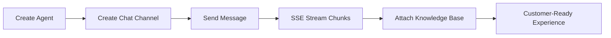

# AI Sandbox SDK for Python


## UX-First Value Cards

| Quick Integration | Real-Time Experience | Reliability by Default |
| --- | --- | --- |
| Minimal setup and low-change onboarding | Streaming chunks via `send_chat_stream(...)` | Built-in timeout and retry controls |

## Visual Integration Flow



## 60-Second Quick Start

```python
import os
from ai_sandbox_sdk import AiSandboxClient

client = AiSandboxClient(
    base_url=os.getenv("AI_SANDBOX_BASE_URL", "https://www.egroupai.com"),
    api_key=os.getenv("AI_SANDBOX_API_KEY", ""),
)

agent = client.create_agent({
    "agentDisplayName": "Support Agent",
    "agentDescription": "Handles customer inquiries",
})
agent_id = int(agent["payload"]["agentId"])

channel = client.create_chat_channel(agent_id, {
    "title": "Web Chat",
    "visitorId": "visitor-001",
})
channel_id = channel["payload"]["channelId"]

for chunk in client.send_chat_stream(agent_id, {
    "channelId": channel_id,
    "message": "What is the return policy?",
    "stream": True,
}):
    print(chunk)
```

## Installation

```bash
pip install ai-sandbox-sdk-python
```

## Snapshot

| Metric | Value |
| --- | --- |
| API Coverage | 11 operations (Agent / Chat / Knowledge Base) |
| Stream Mode | `text/event-stream` with `[DONE]` handling |
| Error Surface | `ApiError` with status/body/trace_id |
| Validation | Production-host integration verified |

## Links

- [Official System Integration Docs](https://www.egroupai.com/ai-sandbox/system-integration)
- [30-Day Optimization Plan](docs/30D_OPTIMIZATION_PLAN.md)
- [Integration Guide](docs/INTEGRATION.md)
- [Quickstart Example](examples/quickstart.py)
- [Repository](https://github.com/eGroupAI/ai-sandbox-sdk-python)
